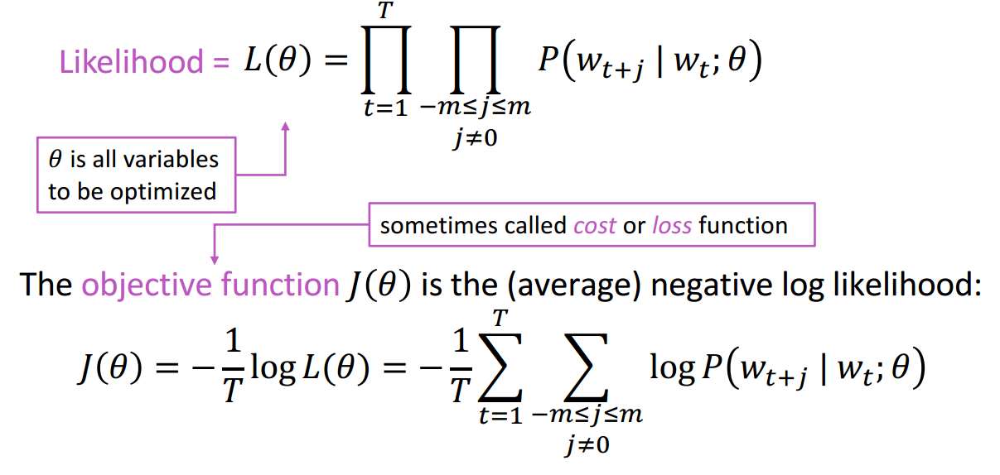
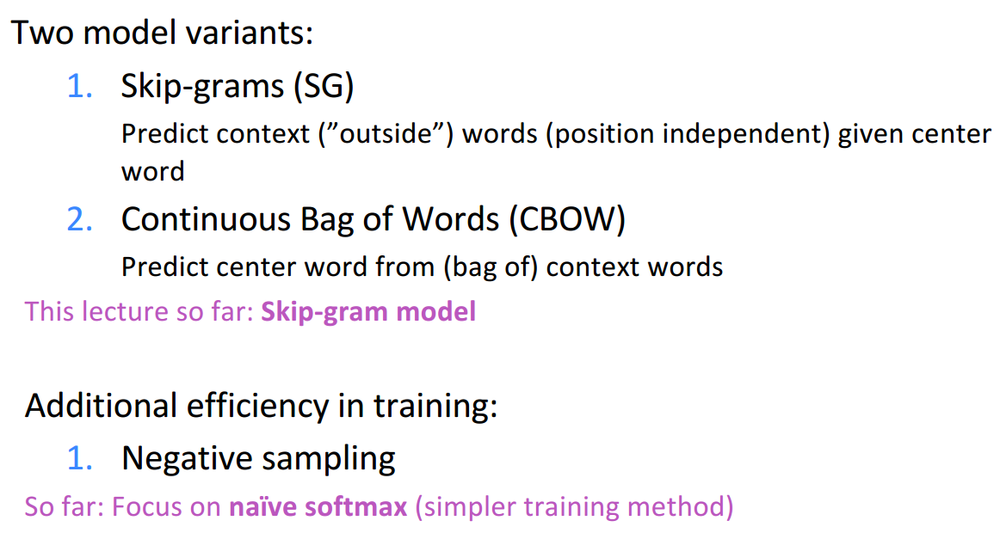

# Lecture 1 & 2: Word Vectors

## Part 1

### 1. Administration:

**This course hopes to teach:**

- the understanding of the effective modern methods for deep learning used in NLP
- a big picture of understanding human languages and the difficulties in building them
- an understanding of and ability to build NLP systems (in PyTorch), such as explaining word meaning, dependency parsing, machine translation, question answering

**Final project:**

- default: on dataset SQuAD

### 2. Human language and human evolutions

*The professor talks about this topic.*

Human languages are a most important invention.Knowledge can be represented in languages and this makes human beings powerful.

**A huge challenge is to represent the meaning of a word:**

1. problem with resources like WordNet: missing nuance, new meanings; subjective, hard to create and adopt; not able to compute easily.
2. traditional NLP (~2012): regards words as discrete symbols like one-hot vectors. **But English words can be countless. More importantly, discrete words share no relationship. (Orthogonal in math terms.)**

These problems lead to distributed semantics. "Distributed" means contexts.

> You shall know a word by the company it keeps. 

Contexts Matters.

And compared to one-hot vectors, more dense vectors have practical benefits.

### 3. Word2Vec: Overview

Word2Vec is a tool to compute word vectors.

Example:

### 4.  Word2Vec derivations of gradient

$$
\begin{split}  max \  J'(\theta) &= \prod_{t=1}^{T}\prod_{-m\le j \le, j\ne\sigma} p(w'{t+j} | w_t; \theta)  \\ 
min \ J(\theta) &= -\frac{1}{T} \sum_{t=1}^T\sum_{-m \le j \le m, j\ne 0}  \log \ p(w'{t+j} | w_t)  \\ 
p(o|c) &=  \frac{\exp(u_o^Tv_c)}{\sum_{w=1}^V \exp(u_w^Tv_c)} \\
\end{split}
$$

$$
\begin{split}
&\ \ \ \  \ \frac{\partial}{\partial v_c} \ log \frac{\exp(u_o^Tv_c)}{\sum_{w=1}^V \exp(u_o^Tv_c)} \\
 &= \frac{\partial}{\partial v_c} \ log \ exp(v_o^Tv_c)\ - \ \frac{\partial}{\partial v_c} \log \sum^V_{w=1} \exp(u_o^T v_c).  \\ 
  & \frac{\partial}{\partial v_c} u_o^T v_c  = u_o ,  \ \frac{\partial}{\partial v_c} \log \sum_{w=1}^V \exp(u_o^T v_c) = \frac{1}{\sum^V_{w=1} \exp(u_o^T v_c)} \cdot \sum^V_{x=1} \frac{\partial}{\partial v_c} \exp(u_x^T v_c) \cdot u_x
\end{split}
$$

$$
\frac{\partial}{\partial v_c} \log \ p(o|c) = u_o - \sum_{x=1}^V \frac{\exp(u_x^T v_c)}{\sum_{w=1}^V \exp(u_w^T v_c)} \cdot u_x \\ 
 = u_o - \sum_{x=1}^T p(x|c) \cdot u_x
$$

### 5. Optimization: Gradient Descent

Solution: Stochastic gradient descent.

## Part 2

### 1. Word2vec parameters and computations

