# Lecture 1 & 2: Word Vectors

## Part 1

### 1. Administration:

**This course hopes to teach:**

- the understanding of the effective modern methods for deep learning used in NLP
  - basics, RNN, Attention, etc.
- a big picture of understanding human languages and the difficulties in building them
- an understanding of and ability to build NLP systems (in PyTorch), such as explaining word meaning, dependency parsing, machine translation, question answering

**Final project:**

- default: on dataset SQuAD

### 2. Human language and word meaning

Human languages are a most important invention. Knowledge can be represented in languages and this makes human beings intelligent. We have a human computer network that is organized by human languages.  Speaking and writing are powerful inventions.

Human languages are highly compressive. Sentences with the latent huge knowledge-graphs can easily construct complicated visual scenes in mind.  

**A huge challenge of NLP is to represent the meaning of a word:**

1. problem with resources like WordNet: missing nuance, new meanings; subjective, requiring labor to create and adopt; not able to compute easily.
2. traditional NLP (~2012): regards words as discrete symbols like one-hot vectors. **But English words can be infinite; discrete symbols share no relationship. (Orthogonal, in math terms.)**

Word similar table can be expensive.

**Solutions:**

- re-encode words into vectors and similarities reside in 

These problems lead to distributed semantics. "Distributed" means contexts.

> You shall know a word by the company it keeps. 

Contexts Matters.

And compared to one-hot vectors, denser vectors have practical benefits.

### 3. Word2Vec: Overview

Word2Vec is a tool to compute word vectors.

Example:

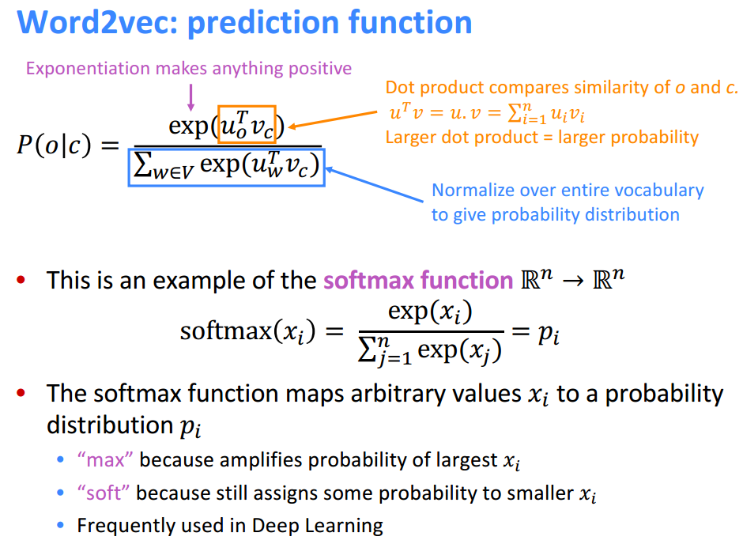

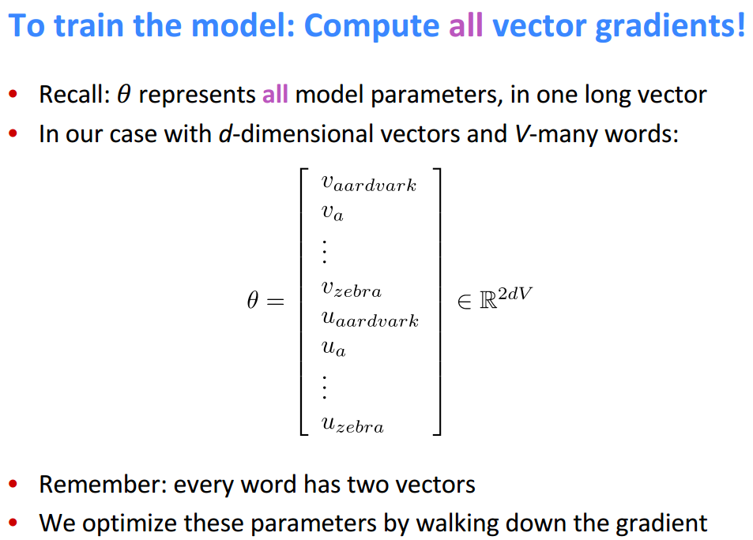

### 4.  Word2Vec objective function gradients

$$
\begin{split}  max \  J'(\theta) &= \prod_{t=1}^{T}\prod_{-m\le j \le, j\ne\sigma} p(w'_{t+j} | w_t; \theta)  \\ 
min \ J(\theta) &= -\frac{1}{T} \sum_{t=1}^T\sum_{-m \le j \le m, j\ne 0}  \log \ p(w'_{t+j} | w_t)  \\ \\

p(o|c) &=  \frac{\exp(u_o^Tv_c)}{\sum_{w=1}^V \exp(u_w^Tv_c)} \\
\end{split}
$$

$$
\ \ \  \ \frac{\partial}{\partial v_c} \ log \frac{\exp(u_o^Tv_c)}{\sum_{w=1}^V \exp(u_o^Tv_c)} \\
 = \frac{\partial}{\partial v_c} \ log \ exp(u_o^Tv_c)\ - \ \frac{\partial}{\partial v_c} \log \sum^V_{w=1} \exp(u_o^T v_c).  \\ 
   \frac{\partial}{\partial v_c} u_o^T v_c  = u_o,   \\
   \frac{\partial}{\partial v_c} \log \sum_{w=1}^V \exp(u_o^T v_c) = \frac{1}{\sum^V_{w=1} \exp(u_w^T v_c)} \cdot \sum^V_{x=1}   \exp(u_x^T v_c) \cdot u_x
$$

$$
\frac{\partial}{\partial v_c} \log \ p(o|c) = u_o - \sum_{x=1}^V \frac{\exp(u_x^T v_c)}{\sum_{w=1}^V \exp(u_w^T v_c)} \cdot u_x \\ 
 = u_o - \sum_{x=1}^T p(x|c) \cdot u_x
$$

## Part 2

***[Explain the notebook and word vector visualization]***

### 1. Finish looking at word vectors and word2vec

Word2vec parameters and computations

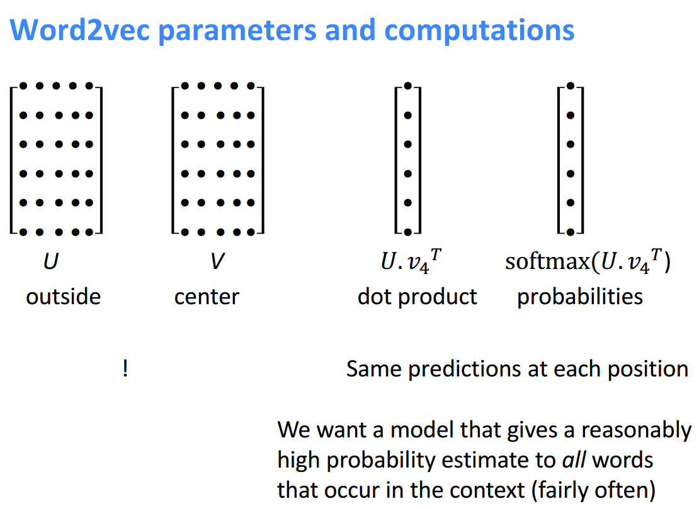

; sealing with high-frequency words

### 2. Optimization basics

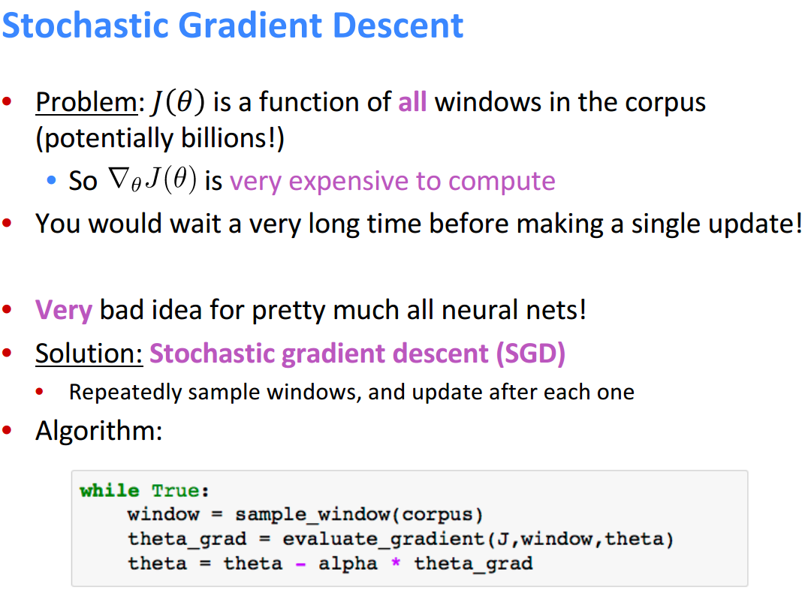

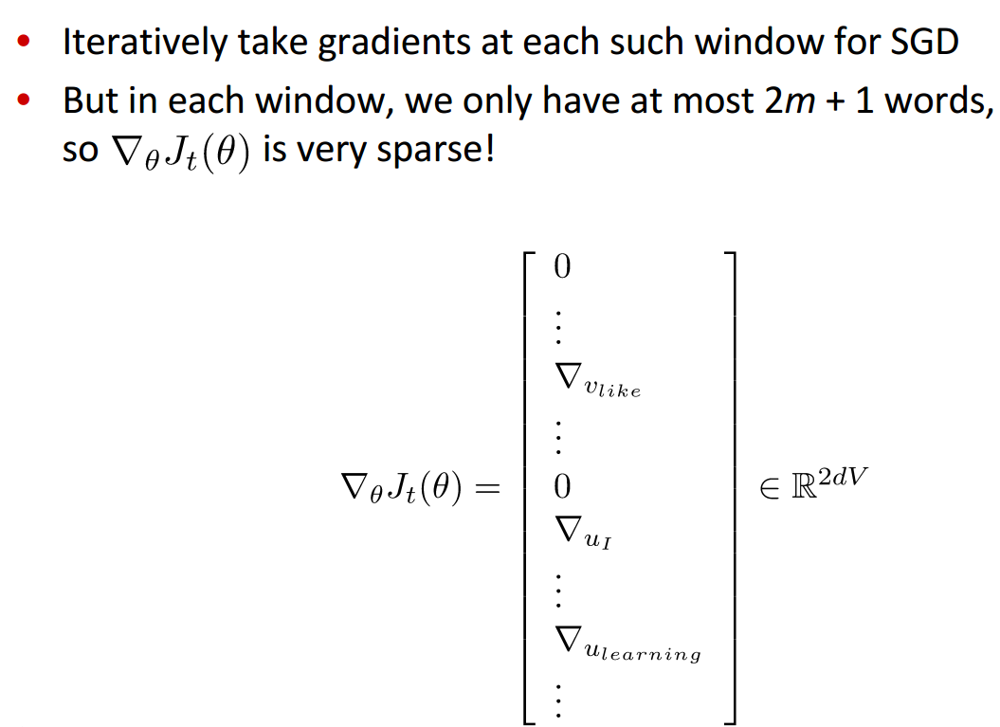

**Solution: Only update the word vectors that actually appear.**

Either you need sparse matrix update operations to only update certain rows of full embedding matrices U and V, or you need to keep around a hash for word vectors.

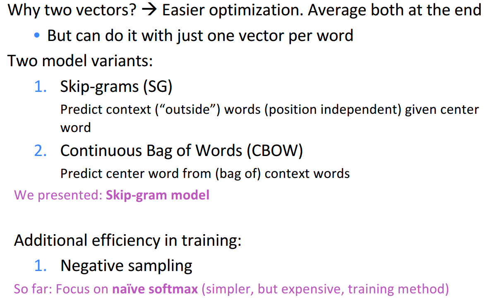

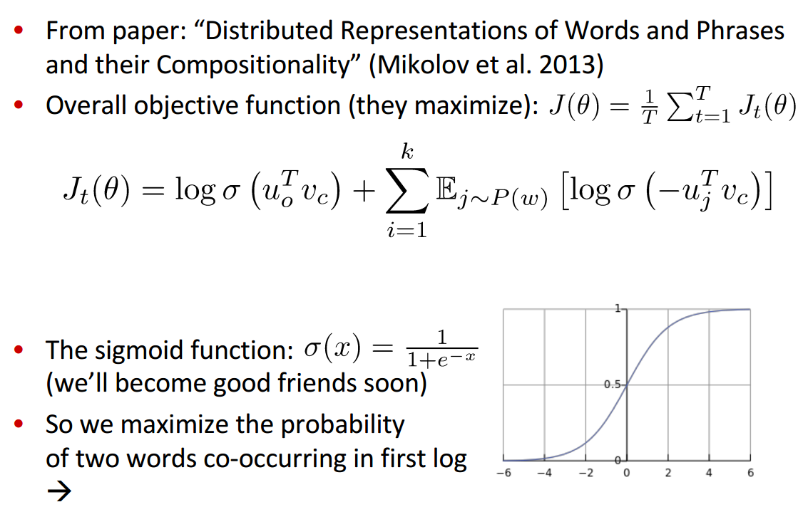

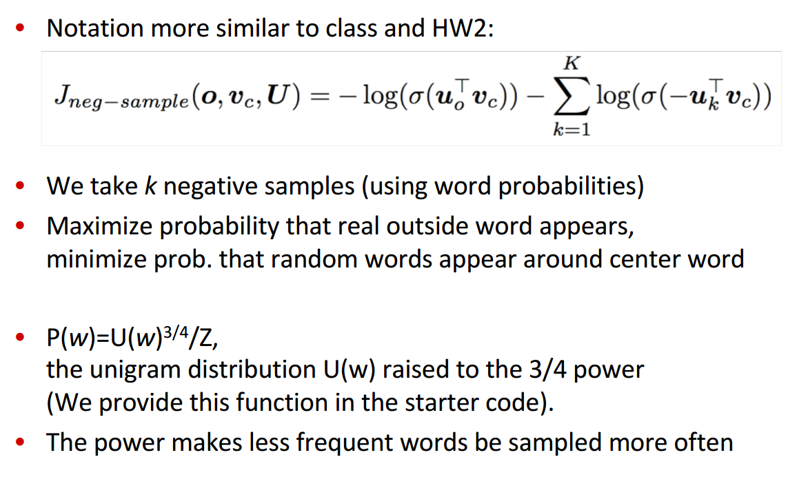

The work done behind the word2vec paper has lots of tricks to make it practical.

### 3. But why not capture co-occurrence counts directly?

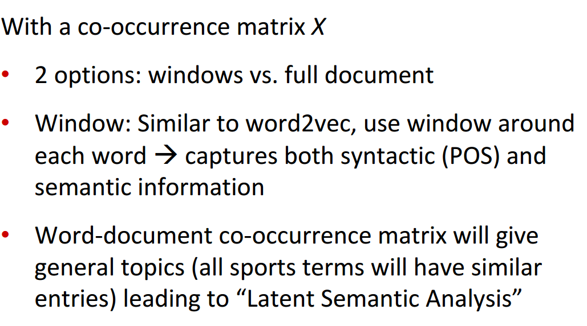

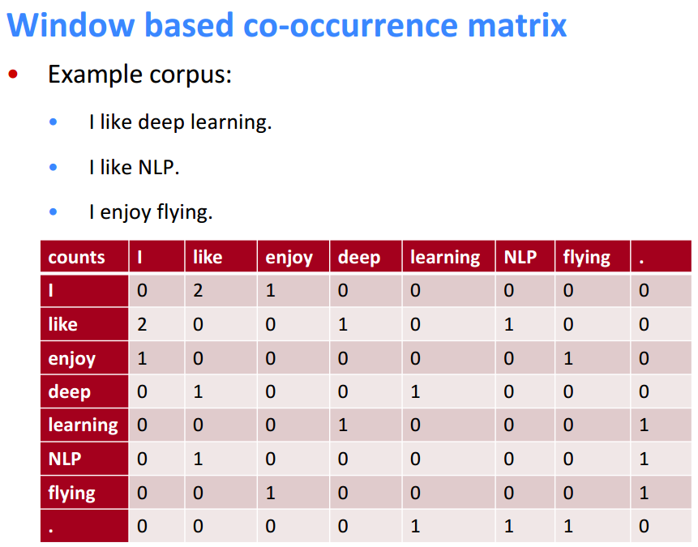

**Problems with simple co-occurrence vectors: **

- Increase in size with vocabulary
- Very high dimensional 
- Subsequent classification models have sparsity issues

Models are less robust.

**Solution: Low dimensional vectors **

- Idea: store "most" of the important information in a fixed, small number of dimensions: a dense vector
- Usually 25-1000 dimensions, similar to word2vec
- How to reduce the dimensionality?

#### Method 1: Dimensionality Reduction on X

SVD of co-occurrence matrix X: Factorizes X into $U\Sigma V^T$, where U and V are orthonormal.

**Hacks to X: scaling the counts in the cells can help a lot.**

- Problem: function words are too frequent -> syntax has too much impact. Some fixes:
  - min(X, t), with t $\approx$ 100
  - Ignore them all

- Ramped windows that count closer words more

- Use Person correlations instead of counts, then set negative values to 0.

- Etc.

### 4. The schools of work 

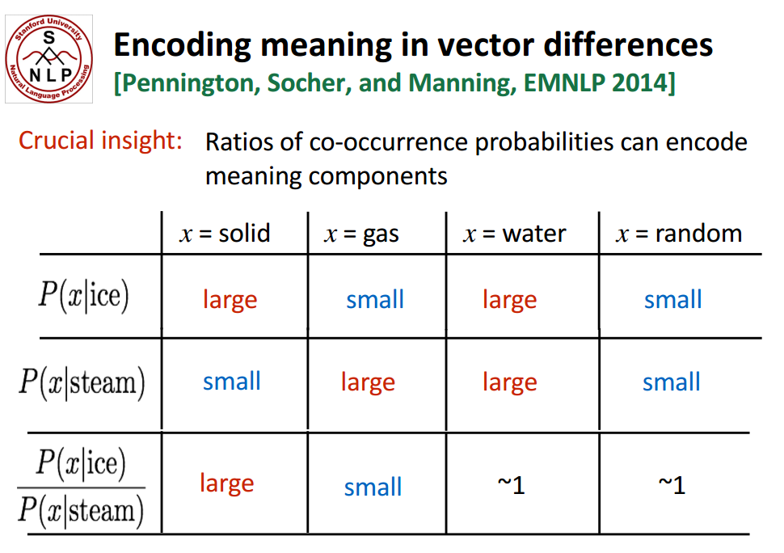

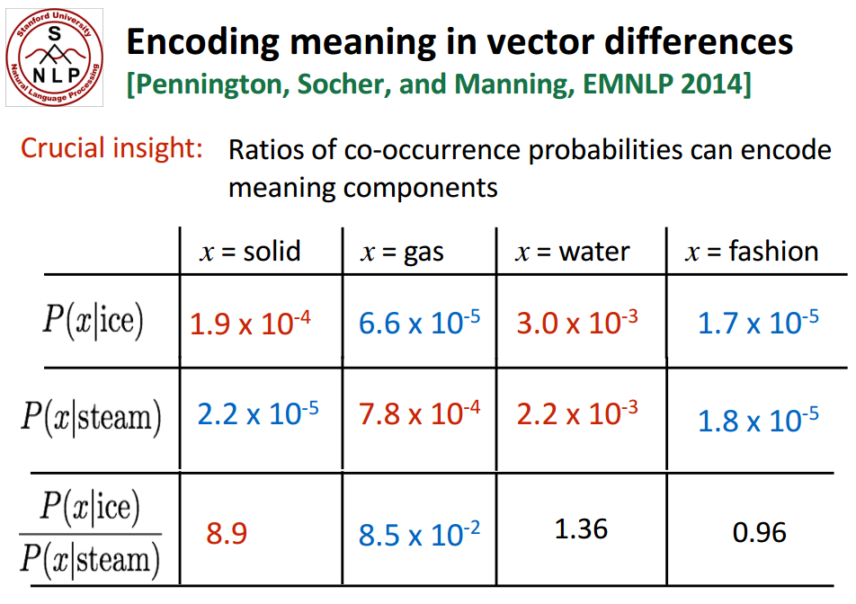

Can we combine the two?

GloVe.

**Features:**

- Fast training
- Scalable to huge corpora 
- Good performance even with small corpus and small vectors

### 5. How to evaluate word vectors?

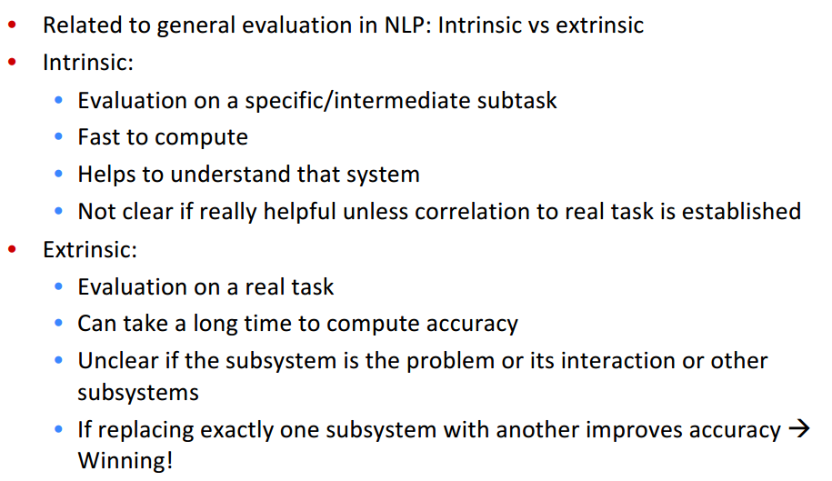

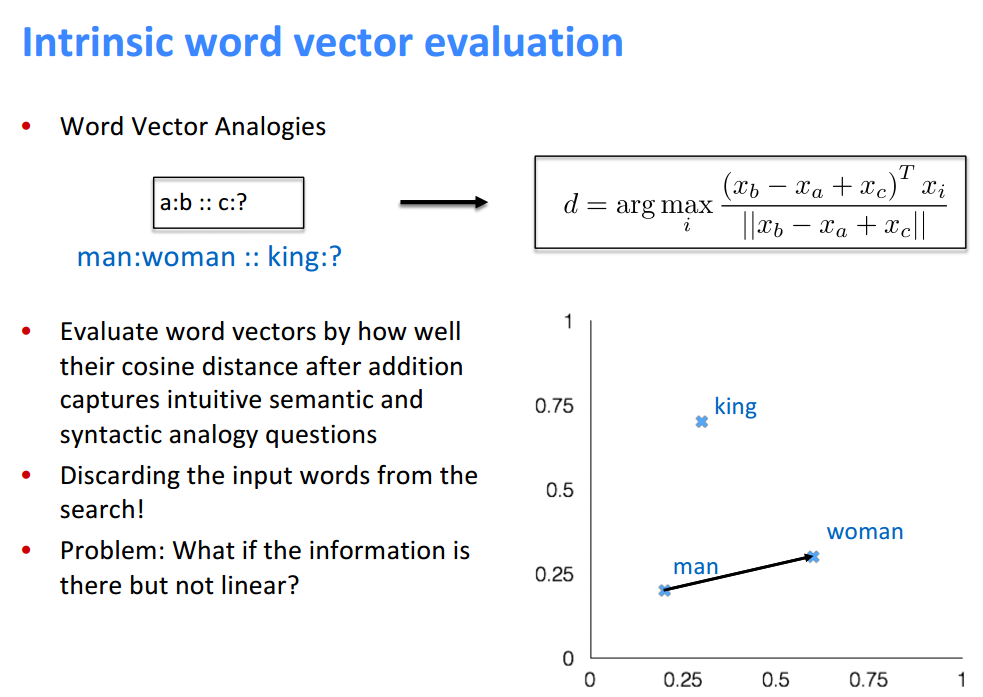

***Question: how to choose a good dimension of word vector?***

~300 is usually good enough.

Paper: [on the dimensionality of word embedding]

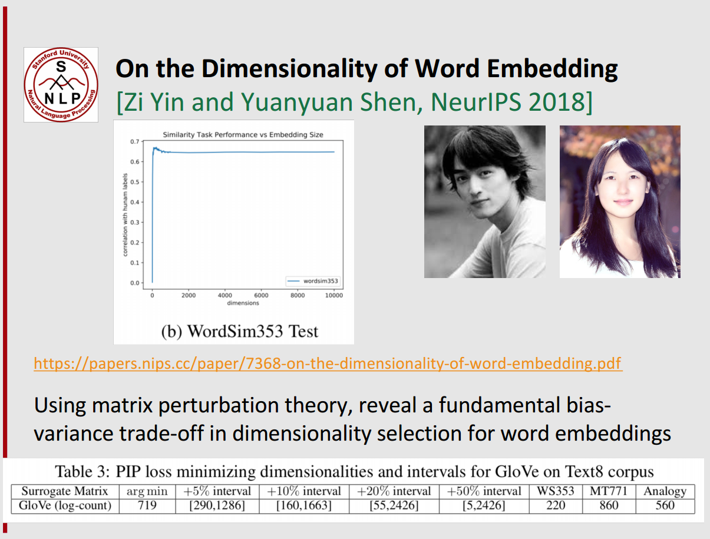

#### Extra: word senses and word sense ambiguity

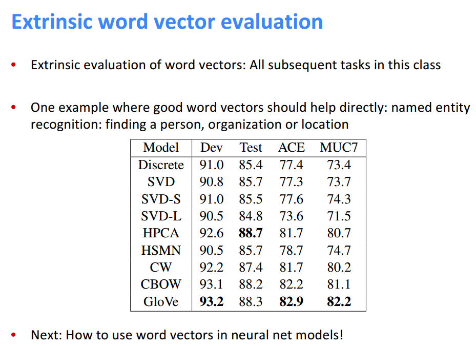

